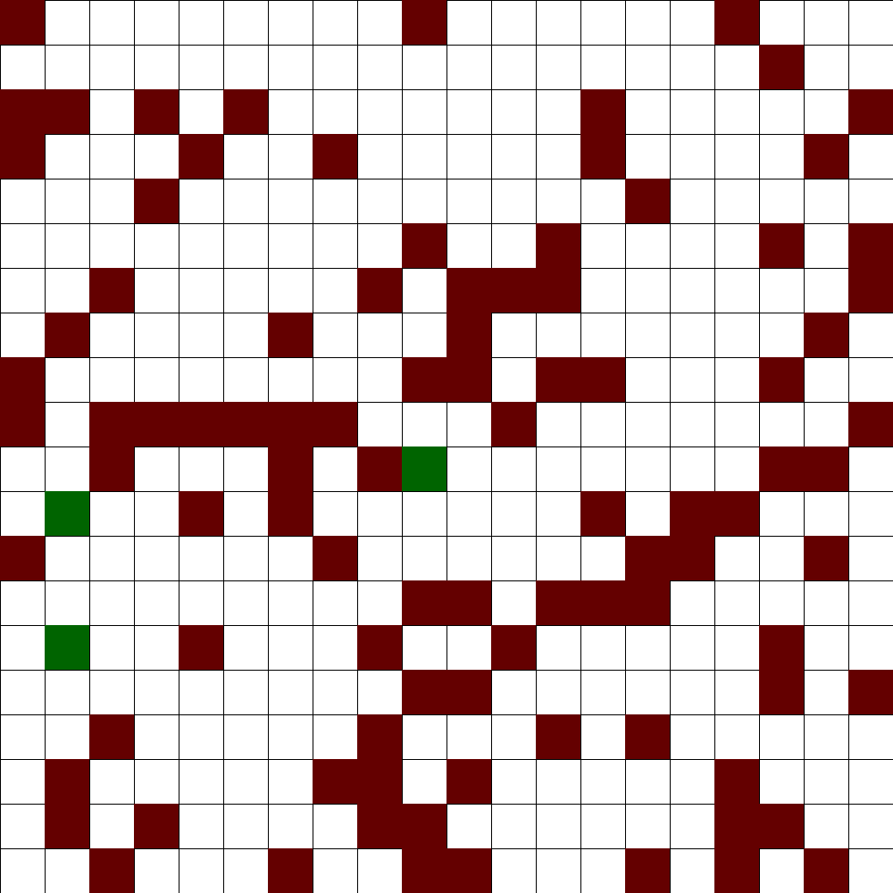

# Reinforcement Learning: explicit demo

## What it is all about

Consider the simplest static version of  "frozen lake" game:

  

where the red squares represent the ice traps: if the mover hits the red square  the gave is over with the score "-1" (lose). The green squares are exits: hiting one of them, the game is over with the score "+1" (win). 
