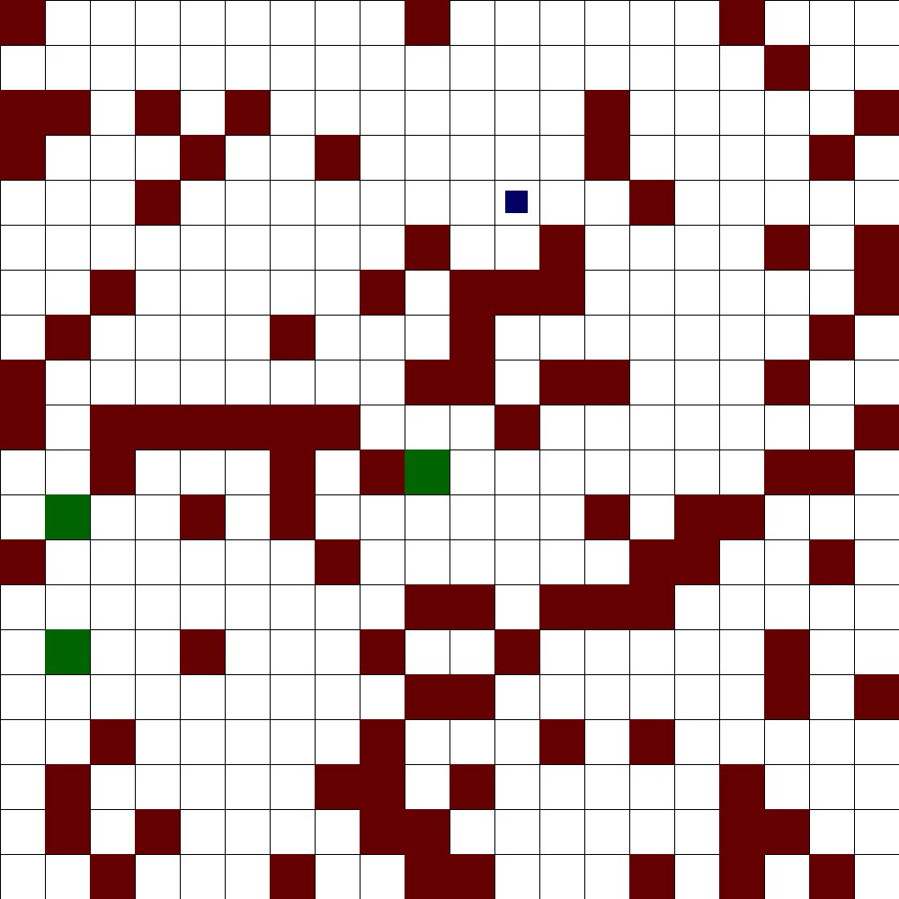

# Reinforcement Learning: basic demo

## What it is all about

Consider the simplest static version of the "frozen lake" game:

<p align="center">
  
</p>

where the red squares represent the "ice" traps: if the mover (small blue square) hits one of them the game is over with the reward "-1" (lose). The green squares are "exits": by hitting one of them, the game is over with the reward "+1" (win). 

After being randomly generated the environment is fixed (saved as numpy array in `env.npz`) and the agent is trained to learn it. Training goes over episodes. In each episode the mover is randomly placed in a free field and steps until pops into trap or successfully exits. In the training regime, steps are done either according to the q-table or completely randomly. This is regulated by randomly generated $0<\epsilon<1$: if $\epsilon>0.5$, the step is selected as suggested by the qtable, or taken randomly, if otherwise. Random steps are needed in order to learn the environment; it also guarantees that the training episode will be finite, e.g. if the mover is getting arrested in a particular environment landscape.

With the `step` taken from `s` position (`s+step -> s_new`) the corresponding entry in the q-table is getting updated (and saved as numpy array in `qtable.npy`):
```
qtable[s,step] = q_table  + lr * (reward[s_new] + gamma*qtable[s_new, step_new] - qtable), 
```
where `0<lr<1` and `0<gamma<1`  are the fixed learning rate and discount parameters.  The `step_new` is the new step from the new position `s_new` suggested by the q-table (it might not be necessarily taken).

The training episodes are repeated until the q-table is getting stable, i.e. does not change anymore. Once it is stabilized one can run the test episodes, just by setting the $\epsilon=1$  which guarantees that all steps are taken according to the qtable.


## Implementation

To run train or test, all you need is just to:
```
python main.py
```
The run is controlled by `config.json` file.

### config.json

```
{
    "outdir": "png",                           - folder with episodes subfolders; each subfolder contains images with moves. Is overwritten in each run
    "resolution": 50,			       - images resolution. Refers to a single field, i.e. the full image size is environment_shape[0] * res x environment_shape[1] * res 
    "n_episodes": 10,			       - number of episodes. For training the good number is >10000
    "save_every": 1,			       - if you train for many episodes, it makes sense to save them more rarely
    "environment": { "new": "False",	       - if "True", the environment (as well as the qtable) will be initiated from scratch 
		     "shape": [20,20,1],       - shape of the environment. In fact it is 2-dimensional: the third dimension will be removed, but I need to do it clean.
         	     "danger_ratio": 0.20,     - ratio of the traps relative to the total number of fields in the environment
		     "number_of_exits": 3,     - number of exits (stops)
		     "saved": "env.npz",       - file to store the environment information in numpy format
		     "img": "env.png"},	       - image showing the environment
    "qtable_last": "qlast.npy",		       - file to store the current qtable
    "learning_rate": 0.1,		       - learning rate to update the qtable
    "gamma": 0.1,    			       - discout rate to update the qtable
    "random_step_prob": 0		       - if "0" the steps are selected based on qtable. In training regime some portion of steps must be random - so set it within (0,1) 
}
```

By setting up the environment, take care that the `number of traps + number of exits < total number of fields`.

For training, increase the number of episodes: e.g. set `"n_episodes": 100000` (might increase `"save_every": 1000 ` accordingly). Also set random step probability to nonzero, e.g. `"random_step_prob": 0.5`.

For testing you might not need that many episodes, so reduce "n_episodes" (`"save_every": 1 ` accordingly) and set `"random_step_prob": 0`.

